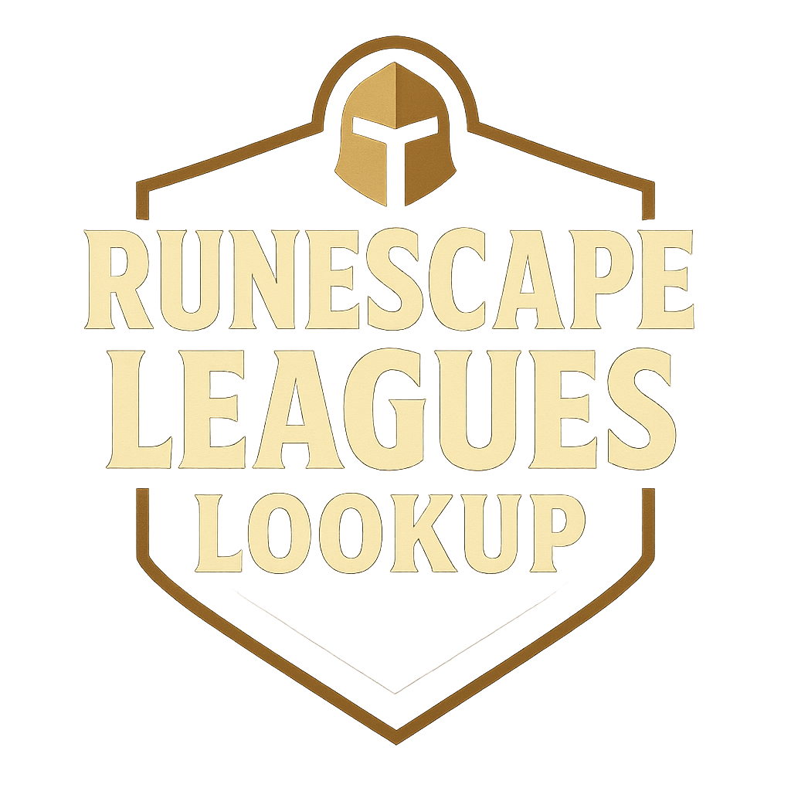

# 🎮 RuneScape Leagues Lookup

An **unofficial fan website** dedicated to RuneScape 3 players participating in Leagues seasons. Check your progress, skill stats, and League task completion status.



## ⚡ Features

- 📊 **Comprehensive skill stats visualization**
- ✅ **Tracking of completed and incomplete tasks**
- 🏆 **Trophy system based on points earned**
- 📍 **Organization by regions and locations**
- 📱 **Modern, responsive design**
- 📊 **Graphs for completed and incomplete tasks**

## 🛠️ Technologies Used

- **React Router 7** - Routing and navigation
- **TypeScript** - Static typing
- **Mantine UI** - Interface components
- **TailwindCSS** - Styling and utilities
- **Zustand** - Global state management
- **React Query** - Data fetching and caching

## 🚀 Installation & Usage

```bash
# Clone the repository
git clone https://github.com/Luedan/leagues_rs.git

# Navigate to the directory
cd leagues_rs

# Install dependencies
npm install

# Start in development mode
npm run dev

# Build for production
npm run build
```

## 📱 Screenshots

*Coming soon...*

## 🤝 Contributions

Contributions are welcome! To contribute:

1. Fork the project
2. Create a feature branch (`git checkout -b feature/new-feature`)
3. Commit your changes (`git commit -m 'Add new feature'`)
4. Push to the branch (`git push origin feature/new-feature`)
5. Open a Pull Request

## 📄 License

This project is under the MIT License. See the [LICENSE](LICENSE) file for more details.

## ⚠️ Disclaimer

This is an independent fan project and **is not affiliated with, endorsed, or sponsored by Jagex Ltd**. RuneScape is a registered trademark of Jagex Ltd.

## 👨‍💻 Developer

**Luedandev** - Developed with ❤️ by a passionate RuneScape fan

[](https://www.linkedin.com/in/luedandev/)
[](https://github.com/Luedan)

## 📞 Contact

- **GitHub Issues**: To report bugs or request features
- **LinkedIn**: For professional contact
- **Repository**: [leagues_rs](https://github.com/Luedan/leagues_rs)

---

*Enjoy exploring your Leagues stats! 🎯*
